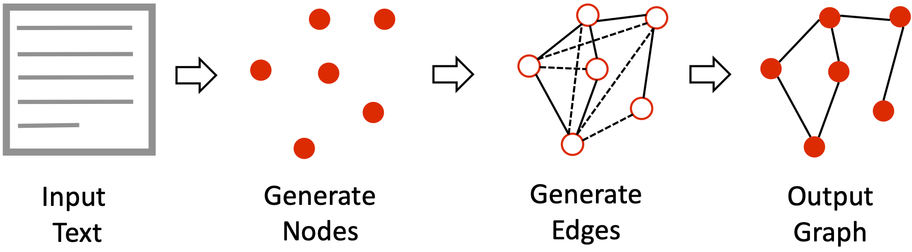
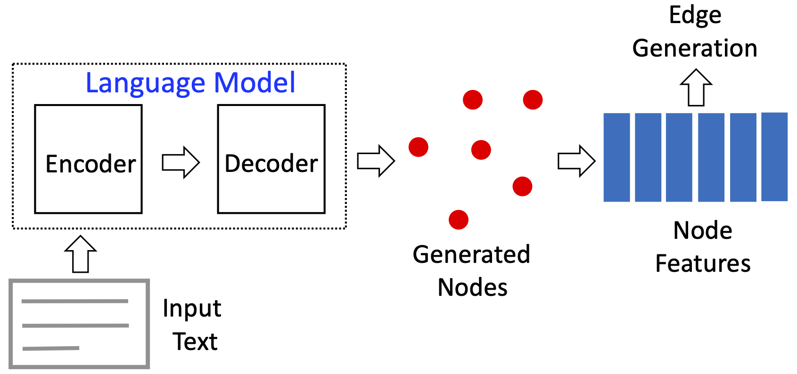
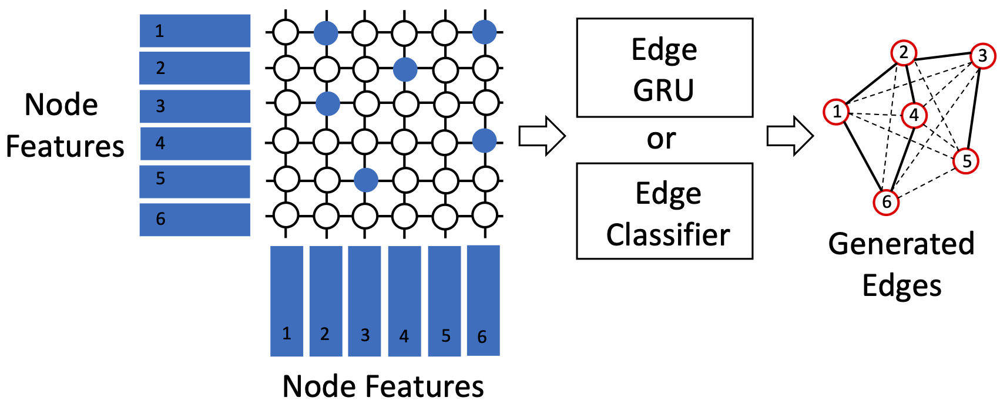

<div align="center">    
 
# Knowledge Graph Generation From Text

[](https://arxiv.org/abs/2211.10511)
[](https://2022.emnlp.org/)
 
<!--  
Conference   
-->   
</div>

## Description   
Grapher is an end-to-end multi-stage Knowledge Graph (KG) construction system, that separates the overall generation process  into  two  stages.
<p align="center">
  
</p>
The  graph  nodes  are generated first using pretrained language model, such as T5.The input text is transformed into a sequence of text entities. The features corresponding to each entity (node) is extracted and then sent to the edge generation module.
<p align="center">
  
</p>
Edge construction, using generation (e.g.,GRU) or a classifier head. Blue circles represent the features corresponding to the actual graph edges (solid lines) and the white circles are the features that are decoded into ⟨NO_EDGE⟩ (dashed line).
<p align="center">
  
</p>

## Environment
Install miniconda and create a conda environment with the following command, which also sets the python version:
`conda create -n data_science python=3.10.6`
Activate your conda environment with
`conda activate data_science`
Install the requirements.txt file
`pip install -r requirements.txt`
  

## Setup   
Install dependencies   
```bash
# clone project   
git clone git@github.com:IBM/Grapher.git

# clone another external repositories for scoring the results
cd cd Grapher/src
git submodule add https://github.com/WebNLG/WebNLG-Text-to-triples.git WebNLG_Text_to_triples
 ```

## Data
We pull the WebNLG 3.0 dataset from hugging face. It is done automatically in the script datasets.py.


## How to train
There are two scripts to run two versions of the algorithm
```bash
# naviagate to scripts directory
cd src/scripts

# run Grapher with the edge generation head
# Description from the paper: The advantage of generation is the ability to construct any edge sequence, including ones unseen during training, at the risk of not matching the target edge token sequence exactly.
./train_gen.sh

# run Grapher with the classifier edge head
# Description from the paper: if the set of possible relationships is fixed and known, the classification head is more efficient and accurate
./train_class.sh
```

## How to test
```bash
# run the test classifier edge head with using latest checkpoint last.ckpt
source .env && python3 main.py --run test --version 1 --default_root_dir ${STORAGE_DRIVE}/data/core/grapher/output --data_path ${STORAGE_DRIVE}/data/core/webnlg-dataset/release_v3.0/en

# run the test classifier edge head using checkpoint at iteration 5000
# Note: This does not work currently because the filename of the checkpoints has been updated
# python3 main.py --run test --version 1 --default_root_dir ${STORAGE_DRIVE}/data/core/grapher/output #--data_path ${STORAGE_DRIVE}/data/core/webnlg-dataset/release_v3.0/en --checkpoint_model_id 5000
```

## Visualize Training Results
Results can be visualized in Tensorboard
```bash
tensorboard --logdir output --load_fast=false
```

## How to run inference
```bash
# run inference classifier edge head (version 1) or alternatively edge generation head (version 2) using latest checkpoint last.ckpt
source .env && python3 main.py --run inference --version ${MODEL_VERSION} --default_root_dir ${STORAGE_DRIVE}/data/core/grapher/output --inference_input_text "Danielle Harris had a main role in Super Capers, a 98 minute long movie."
```


### Citation   
```
@inproceedings{grapher2022,
  title={Knowledge Graph Generation From Text},
  author={Igor Melnyk, Pierre Dognin, Payel Das},
  booktitle={Proceedings of the 2022 Conference on Empirical Methods in Natural Language Processing (Findings of EMNLP)},
  year={2022}
}
```   

# Reproducibility study
* The scripts ./train_gen and ./train_class.sh both produce an error during execution due to several non-existing arguments passed during the call of main.py (see below).
```
main.py: error: unrecognized arguments: --max_epochs 100 --accelerator gpu --num_nodes 1 --num_sanity_val_steps 0 --fast_dev_run 0 --overfit_batches 0 --limit_train_batches 1.0 --limit_val_batches 1.0 --limit_test_batches 1.0 --accumulate_grad_batches 10 --detect_anomaly True --log_every_n_steps 100 --val_check_interval 1000
```

* Some additional libraries are required, such as `SentencePie`(See below).
```
T5Tokenizer requires the SentencePiece library but it was not found in your environment. Checkout the instructions on the installation page of its repo: https://github.com/google/sentencepiece#installation and follow the ones that match your environment. Please note that you may need to restart your runtime after installation.
```

* Instead of just cloning the two separately needed git repositories corpusreader and WebNLG-Text-to-triples, I added them as submodules (See [Setup](#Setup) section) and included them in gitignore in order to not track the pycache changes.

* I added the parameter cache_dir to point to a directory with enough space, because the model training requires 2950.74 MB for T5.

* I updated two function names and interfaces in litgrapher.py (now called grapher_lightning.py) due to incompatibilities with pytorch_lightning >= 2.0.0:
```
validation_epoch_end -> on_validation_epoch_end
test_epoch_end -> on_test_epoch_end
```
